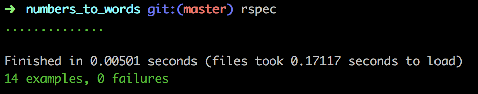
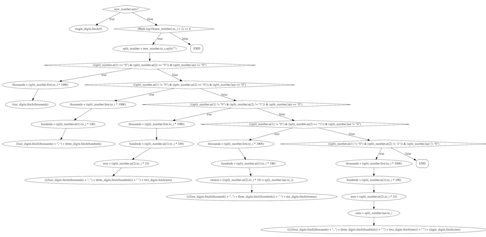

# numbers_to_words

## GitHub repository: https://github.com/r-craig73/number_to_words

#### By Ron Craig (https://github.com/r-craig73) & Kimberly Huynh (https://github.com/kihuynh)

## Description
#### An Epicodus lesson 02/06/2018: Create a Ruby method on that takes an integer and returns the number's word version.
#### Some rules...
1. Do not define methods in main.
2. The logic should include custom classes with instance methods.
3. All methods should be called on instances of a class.

#### Scrabble Score Case Specs
1. The method returns the string 'zero' when the number is 0.
  * input = Counter.new(0)
  * output: expect(input.words).to(eq('zero'))
2. The method returns the string 'two' when the number is 2.
  * input = Counter.new(2)
  * output: expect(input.words).to(eq('two'))
3. The method returns the string 'sixteen' when the number is 16.
  * input = Counter.new(16)
  * output: expect(input.words).to(eq('sixteen'))
4. The method returns the string 'thirty' when the number is 30.
  * input = Counter.new(30)
  * output: expect(input.words).to(eq('thirty'))
5. The method returns the string 'ninety nine' when the number is 99.
  * input = Counter.new(99)
  * output: expect(input.words).to(eq('ninety nine'))
6. The method returns the string 'one hundred' when the number is 100.
  * input = Counter.new(100)
  * output: expect(input.words).to(eq('one hundred'))
7. The method returns the string 'two hundred nineteen' when the number is 219.
  * input = Counter.new(219)
  * output: expect(input.words).to(eq('two hundred nineteen'))
8. The method returns the string 'four hundred twenty' when the number is 420.
  * input = Counter.new(420)
  * output: expect(input.words).to(eq('four hundred twenty'))
9. The method returns the string 'nine hundred ninety nine' when the number is 999.
  * input = Counter.new(999)
  * output: expect(input.words).to(eq('nine hundred ninety nine))
10. The method returns the string 'one thousand' when the number is 1000.
  * input = Counter.new(1000)
  * output: expect(input.words).to(eq('one thousand'))
11. The method returns the string 'six thousand, four hundred twenty' when the number is 6420.
  * input = Counter.new(6420)
  * output: expect(input.words).to(eq('six thousand, four hundred twenty'))
12. The method returns the string 'eight thousand, two hundred nineteen' when the number is 8219.
  * input = Counter.new(8219)
  * output: expect(input.words).to(eq('eight thousand, two hundred nineteen'))
13. The method returns the string 'four thousand, two hundred thirty eight' when the number is 4238.
  * input = Counter.new(4238)
  * output: expect(input.words).to(eq('four thousand, two hundred thirty eight'))
14. The method returns the string 'seven thousand, six hundred' when the number is 7500.
  * input = Counter.new(7600)
  * output: expect(input.words).to(eq('seven thousand, six hundred'))

### Rspec results

### Using Visualize Ruby (https://visualize-ruby.herokuapp.com/), here are the screenshots for different digital branches.
#### 4 Digits Branch

#### 3 Digits Branch

#### 2 Digits & 1 Digit Branch

## Setup/Installation Requirements
### Clone repository.
### Install Ruby and Gems
* `$ gem install rspec`
* `$ gem install pry`
* `$ bundle install`

### Run rspec in the terminal's home directory path
* `numbers_to_words $ rspec`

## Technologies Used
* Ruby
* Ruby script
* Ruby Gems

## Support and contact details
_Please contact ron.craig@comcast.net with questions._

## MIT License